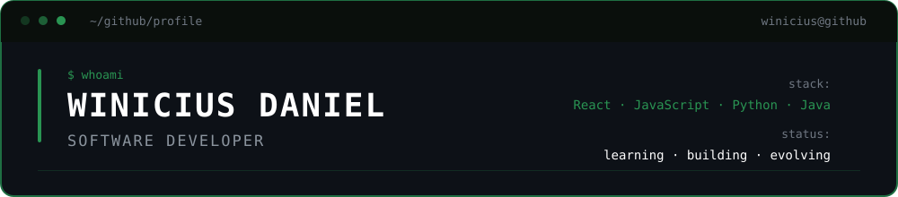

<div align="center">



<br>

<p>
  🎓 Ciência da Computação &nbsp; • &nbsp;
  💻 Desenvolvimento de Software &nbsp; • &nbsp;
  📍 São Paulo, Brasil
</p>

<br>


<br><br>

<p>
  Transformando ideias em aplicações modernas, funcionais e bem estruturadas.
</p>

<br>

<a href="https://trashyukon9.github.io/DanielWn.site/">
  
</a>

<a href="https://www.linkedin.com/in/winicius-daniel-89b4a7279/">
  
</a>

<a href="https://github.com/TrashYukon9">
  
</a>

<br><br>


</div>

<br>

## `> sobre-mim`

```javascript
const winicius = {
  nome: "Winicius Daniel",
  localização: "São Paulo, Brasil",
  formação: "Ciência da Computação",
  área: "Desenvolvimento de Software",

  atualmente: {
    estudando: ["React", "JavaScript", "Python", "Java"],
    explorando: ["Backend", "Engenharia de Software"],
    construindo: "Projetos para evoluir como desenvolvedor"
  },

  interesses: [
    "Desenvolvimento Web",
    "Aplicações úteis",
    "Interfaces modernas",
    "Resolução de problemas"
  ]
};

function rotina() {
  aprender();
  construir();
  melhorar();
}

rotina();
```

<div align="center">

<sub>
  <code>curiosidade + prática + consistência = evolução</code>
</sub>

<br><br>


</div>

<br>

## `> tecnologias`

<div align="center">

### `languages`


<br>

### `frameworks & libraries`


<br>

### `tools`


<br><br>


</div>

<br>

## `> projetos`

<p>
  Alguns projetos que desenvolvi para colocar meus conhecimentos em prática.
</p>

<br>

<table>
<tr>

<td width="50%" valign="top">

<h3 align="center">TODO LIST</h3>

<p align="center">
  Aplicação para gerenciamento de tarefas com foco em organização e produtividade.
</p>

<p align="center">
  <code>React</code>
  <code>JavaScript</code>
  <code>CSS</code>
  <code>Vite</code>
</p>

<br>

<p align="center">

<a href="https://github.com/TrashYukon9/TodoList">
  
</a>

<a href="https://trashyukon9.github.io/TodoList/">
  
</a>

</p>

</td>

<td width="50%" valign="top">

<h3 align="center">PERSONAL PORTFOLIO</h3>

<p align="center">
  Portfólio pessoal para apresentar projetos, habilidades e minha evolução como desenvolvedor.
</p>

<p align="center">
  <code>HTML</code>
  <code>CSS</code>
  <code>JavaScript</code>
</p>

<br>

<p align="center">

<a href="https://github.com/TrashYukon9/DanielWn.site">
  
</a>

<a href="https://trashyukon9.github.io/DanielWn.site/">
  
</a>

</p>

</td>

</tr>
</table>

<div align="center">

<sub>
  <code>mais projetos em desenvolvimento...</code>
</sub>

<br><br>


</div>

<br>

## `> github-stats`

<div align="center">

<p>
  Um pouco da minha atividade e consistência no GitHub.
</p>

<br>


<br><br>

<sub>
  <code>commits • projetos • aprendizado • evolução</code>
</sub>

<br><br>


</div>

<br>

## `> atividade`

<div align="center">

<p>
  Minha atividade e contribuições ao longo do tempo.
</p>

<br>


<br>

<sub>
  <code>cada commit é um passo a mais.</code>
</sub>

<br><br>


</div>

<br>

## `> contribuicoes`

<div align="center">

<p>
  Construindo um pouco todos os dias. 🐍
</p>

<br>

<picture>
  <source
    media="(prefers-color-scheme: dark)"
    srcset="https://raw.githubusercontent.com/TrashYukon9/TrashYukon9/gh-pages/github-contribution-grid-snake-dark.svg"
  />

  <source
    media="(prefers-color-scheme: light)"
    srcset="https://raw.githubusercontent.com/TrashYukon9/TrashYukon9/gh-pages/github-contribution-grid-snake.svg"
  />

  
</picture>

<br><br>

<sub>
  <code>construir • aprender • contribuir • repetir</code>
</sub>

<br><br>


</div>

<br>

## `> contato`

<div align="center">

<h3>Vamos construir algo juntos?</h3>

<p>
  Estou aberto a novas conexões, projetos e oportunidades na área de tecnologia.
</p>

<br>

<a href="https://www.linkedin.com/in/winicius-daniel-89b4a7279/">
  
</a>

<a href="https://trashyukon9.github.io/DanielWn.site/">
  
</a>

<a href="https://instagram.com/tyk.daniwn">
  
</a>

<br><br>


<br><br>


<br>

<sub>
  <code>$ echo "Sempre aprendendo. Sempre evoluindo."</code>
</sub>

<br><br>

<sub>
  Desenvolvido por <strong>Winicius Daniel</strong>
</sub>

</div>
